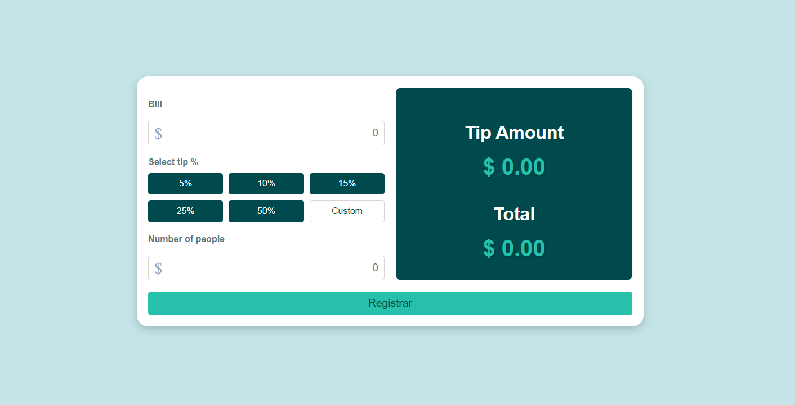

# Calculadora de Pagamento Dividido  

  

Este projeto foi desenvolvido como parte do desafio **Front End Mentor** e tem como objetivo simplificar o processo de pagamento de contas, desde o cálculo de descontos até a divisão do valor final entre os participantes.  

---

## ✨ **Sobre o Projeto**  
A aplicação permite que os usuários:  
- Insiram o valor total de uma conta.  
- Apliquem descontos personalizados.  
- Dividam o valor final entre o número de pessoas, mostrando quanto cada um deve pagar.  

Desenvolvido com **HTML**, **CSS** e **JavaScript**, o projeto entrega uma experiência simples e funcional, priorizando a usabilidade e atendendo aos requisitos do desafio.  

---

## 📦 **Como Rodar o Projeto**  
1. Clone o repositório:  
   ```bash  
   git clone https://github.com/Juanmarcusc/tip-calculator-app-main
